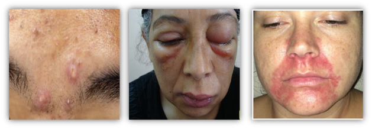
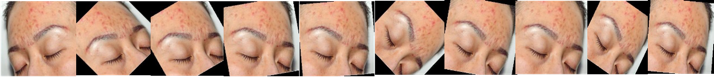
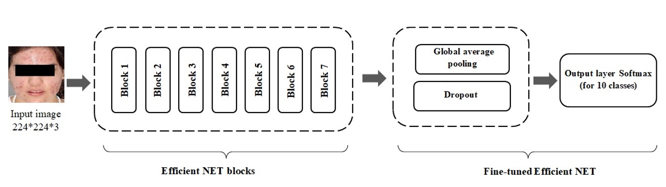
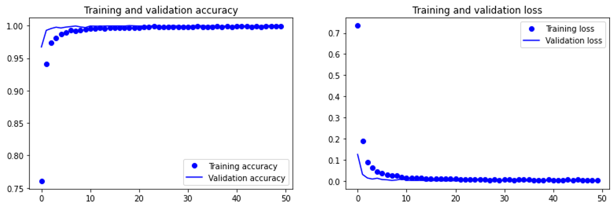

# Introduction

Considering the point that one in three Americans suffers from a skin disease at any given time, in this project, an early alarm system was designed to automatic diagnosis of different skin diseases using deep learning model, i.e., EfficientNet.

**Dataset:**

 * Contains one class of no face, normal face and 8 different diseases (i.e., Acne, Actinic keratosis, Angioedema, Blepharitis, Eczema, Melasma, Rosacea, and Vitiligo)



 * Number of images for each class was 200, then data augmentation was implied with rotating of different angles (-+ 5, 10, 45, 90, 270), to increase the amount of dataset.



## Installation
For python environment setup:


```bash
conda install python=3.9

conda create -n py39 python=3.9
conda activate py39 

conda install -c anaconda tensorflow-gpu
conda install -c anaconda efficientnet

```


## Contributing
* Transfer learning was applied on EfficientNet algorithm.



* **Optimizers:**
  * Stochastic Gradient Descent (SGD)
  

* **Fine-tuning version of EfficientNet, SGD optimizer, block 6&7 activation**


## License

[MIT](https://choosealicense.com/licenses/mit/)